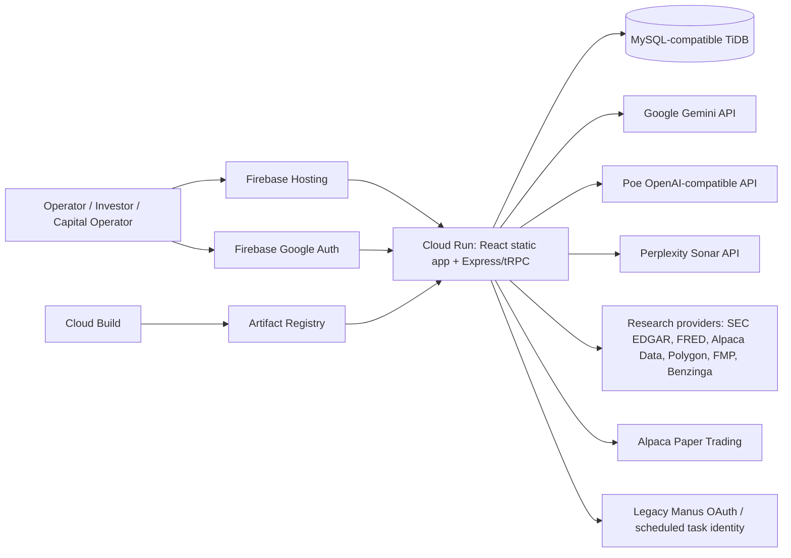

# Signal Hunter OS / Capital Aperture — Product and Architecture Snapshot

**Prepared for:** independent external Claude architecture review

**Snapshot date:** 2026-09-02 (America/New_York)

**Source commit:** `bd7f7f152c1763375377d3ba5c77aa4830b8c2d5`

**Repository:** `million-hunter-dashboard`

**Production URL:** `https://third-signal-capital-aperture.web.app`

**Production runtime:** GCP project `third-signal-v2`, Cloud Run service `capital-aperture`, region `us-central1`

**Production revision at capture:** `capital-aperture-00035-zuk`, 100% traffic

## How Claude should use this document

Treat this as an evidence-backed snapshot of the current implementation, not as proof that every intended capability is production-ready. Review the architecture independently and challenge assumptions.

Please return:

1. A concise architecture assessment.
2. P0/P1/P2 findings, each with impact, evidence, and a concrete remediation.
3. A target architecture that preserves paper-only safety and provenance.
4. A staged migration plan that can ship without a rewrite.
5. Specific answers to the review questions near the end of this document.
6. Any contradictions between product claims, implementation, deployment, and test coverage.

Prioritize tenant isolation, paper-order safety and idempotency, migration provenance, background-job correctness, model/provider routing, observability, test hermeticity, and operator UX. Do not recommend weakening human approval or paper-only controls merely to shorten the interface.

## Truth labels used here

- **Production-verified:** observed from the current GCP/Firebase deployment or a current live metadata query.
- **Implemented:** present in source at the snapshot commit.
- **Provider-dependent:** implemented but requires an external credential, entitlement, network, or current market data.
- **Fixture/demo:** deterministic or illustrative data; not a live claim.
- **Needs review:** a concrete inconsistency, missing proof, or architecture risk found during this snapshot.
- **Not implemented:** no working production path was found.

## Executive summary

Signal Hunter OS is a TypeScript monolith containing two related decision products:

1. **Acquisition OS** — finds and evaluates small-business and commercial-asset acquisition opportunities before formal Quality of Earnings. It combines sourcing, thesis matching, multi-agent diligence, capital-stack modeling, investment memos, investor views, and outreach.
2. **Capital Aperture** — a thesis-first, paper-only public-markets research and decision workspace. It turns a thesis into an authoritative mission revision, cited evidence, a ranked Play Slate, an exact paper ticket, separate approval, separate Alpaca Paper submission, monitoring, and outcomes.

The application is a React/Vite single-page client and an Express/tRPC server bundled into one Cloud Run container. It uses a MySQL-compatible TiDB database through Drizzle ORM. Firebase Hosting is the public edge and rewrites all routes to Cloud Run. Interactive sign-in uses Firebase Google Auth; a legacy Manus OAuth/session path remains for compatibility and scheduled-task identities.

The strongest architectural work is in Capital Aperture's pure risk-gate layer, authoritative Decision Run/Revision binding, paper-only broker adapters, action-time confirmations, and provenance-bearing security-fact ledger. The main risks are migration-control drift, duplicate-prone in-process scheduling on a horizontally scaled runtime, split model/orchestration implementations, a non-hermetic test taxonomy, fragmented environment configuration, and a large monolithic API/data surface with mixed tenancy semantics.

## Product intent and hard boundaries

### Acquisition OS intent

Pressure-test a business or asset before expensive diligence:

`thesis -> source/scan -> qualify -> IC consensus -> red team -> capital stack -> memo -> outreach/LOI`

The positioning is upstream of QoE, not a substitute for accounting, legal, lender, or tax diligence.

### Capital Aperture intent

Turn a market thesis into a clear, risk-bounded paper decision:

`canonical thesis -> capital mission -> decision revision -> provider research -> evidence review -> Play Slate -> exact paper ticket -> approve -> submit to paper broker -> monitor -> outcome/look-back`

### Non-negotiable boundaries

- Paper-only execution. No real-money adapter is enabled.
- No automatic approval or submission.
- Creating a proposal, approving it, and submitting it are distinct state transitions.
- Unknown, stale, contradictory, or unprovable order inputs fail closed.
- Long options are limited to bounded long calls and long puts; no uncovered, short-option, spread, exercise, or assignment path.
- Demo surfaces must be deterministic and zero-API.
- Illustrative/composite data must be labeled; no fabricated testimonials or performance claims.
- Thesis rules may tighten the mandate but cannot loosen it.
- Research evidence, modeled values, human confirmation, broker state, and outcomes remain distinct records.

## System context



### Primary runtime data flow

```mermaid
sequenceDiagram
    participant O as Operator
    participant UI as React UI
    participant API as tRPC/Express
    participant DB as TiDB/Drizzle
    participant RP as Research providers/models
    participant B as Alpaca Paper

    O->>UI: Create or select canonical thesis
    UI->>API: Begin capital mission
    API->>DB: Create Decision Run + immutable revision
    O->>UI: Start provider-backed research
    UI->>API: Run research / collect facts
    API->>RP: Fetch cited evidence and market facts
    RP-->>API: Facts + source + as-of + basis, or explicit gap
    API->>DB: Persist facts, candidates, reviews, slate
    O->>UI: Select play and exact instrument
    UI->>API: Preflight / create proposal
    API->>DB: Resolve account, evidence, mandate, decision binding
    API-->>UI: Passed gates or named blockers
    O->>UI: Type APPROVE PAPER
    UI->>API: Approve
    API->>DB: Re-run all gates and serialize revision authority
    O->>UI: Type SUBMIT PAPER
    UI->>API: Submit
    API->>DB: Re-run gates; write dispatch lease and stable client order ID
    API->>B: Submit paper order
    B-->>API: Accepted, filled, rejected, or ambiguous transport result
    API->>DB: Persist broker status; queue outcome when filled
```

## Technology and repository shape

| Area | Current implementation |
| --- | --- |
| Language | TypeScript 5.9, ESM |
| Client | React 19, Vite 7, Wouter, TanStack Query, tRPC React, Tailwind 4, Radix UI, Recharts |
| Server | Node 22, Express 4, tRPC 11, Zod 4 |
| Data | Drizzle ORM 0.44, MySQL2, production MySQL-compatible TiDB |
| AI | Google GenAI, Poe through OpenAI-compatible chat completions, Perplexity Sonar |
| Agent framework | Google ADK 0.6 plus direct service/orchestrator functions |
| Auth | Firebase Google Auth for interactive users; signed HTTP-only session cookie; legacy Manus OAuth compatibility |
| Broker | Alpaca Paper server-side adapter; manual portfolio adapter; Robinhood declared stub |
| Hosting | Firebase Hosting -> Cloud Run -> Artifact Registry |
| Build | pnpm, Vite client build, esbuild server bundle, multi-stage Docker |
| Tests | Vitest; pure/unit, schema/integration, and opt-in provider/broker lanes |

Current scale of the repository:

- 449 TypeScript/TSX files and about 94,248 lines across `client/src`, `server`, `shared`, and `drizzle`.
- 117 test files.
- 121 TypeScript files under `server/aperture`, including 74 Aperture test files.
- 30 Capital Aperture page/component files.
- 68 Drizzle table declarations.
- 61 SQL migration files.

## Frontend product surfaces

### Public and demo surfaces

| Surface | Route examples | Status |
| --- | --- | --- |
| Marketing landing | `/` when signed out | Implemented |
| Public market/deal exploration | `/explore` | Implemented |
| Demo scenario and tour | `/demo`, `/demo-tour` | Fixture/demo |
| Investor brief | `/brief` | Fixture/demo with deterministic simulators |
| Solo walkthrough | `/walkthrough` | Fixture/demo; designed for zero API and no login |
| Pricing | `/pricing` | Implemented |
| Shared deal/asset links | `/deal-share/:token`, `/asset-share/:token` | Implemented; token-backed |
| Invite acceptance | `/invite/:token` | Implemented |
| Sign-in | `/sign-in` | Production-verified on Third Signal Firebase origin |

### Acquisition OS operator surfaces

- Command Center and portfolio/pipeline status.
- Acquisition Thesis builder and saved property criteria.
- Asset Scout, URL/CSV import, off-market discovery, verification queue, and sourcing schedules.
- Wingate historic-building thesis and asset dossiers.
- Opportunity Radar backed by cited Sonar research; Market Scan is explicitly experimental/non-live.
- Deal room, IC review, owner behavioral profile, red-team analysis, and agent monitoring.
- Capital Stack Modeler, Freedom Map, Strategy Blender, TIDE, RippleEffect, and Investor Dossier.
- Investment Memo library, outreach pipeline, LOI generation, and controlled share links.
- Investor portal, onboarding/DNA, deal views, memo vault, positions, interest expression, scan, and scout.
- Insurance prospector and role-gated administration/operator registry.

### Capital Aperture surfaces

| Surface | Primary job |
| --- | --- |
| Aperture Home / Decision Center | Show active thesis, account posture, constraints, and the one current decision |
| New Thesis / Saved Theses | Create, version, activate, compile, and manage canonical theses |
| Capital Mission revision editor | Bind thesis, paper account, capital, horizon, instrument preference, objective, catalyst deadline, and invalidation |
| Research Journeys / Runs | Collect provider-backed evidence and create candidate research records |
| Candidate Board / Play Slate | Compare direct expressions, portfolio complements, reserve-capital ideas, and alternatives |
| Evidence view | Resolve only decision-critical thesis checks while preserving the source record |
| Strategy Compare / Exposure Map | Compare postures and portfolio effects |
| Paper Ticket | Select shares or exact long-option contract, pricing, quantity, loss ceiling, and review time |
| Play Desk | Cross-run queue of research, tickets, plays in motion, and outcomes due |
| Accounts | Manual portfolio import and Alpaca Paper synchronization |
| Memo Library | Fact-traced investment/research memos |
| Disclosure plans | Congressional-disclosure research rail with lag/entity/collision controls |
| Record / Outcome ledger | Immutable Play Slates, decisions, pending outcomes, monitoring, and look-back |
| Capital walkthrough | Deterministic, zero-provider demonstration rail |

## Backend/API shape

The application exposes one large tRPC router at `/api/trpc`, plus authentication, storage, and scheduled callback routes.

### Top-level tRPC domains

`system`, `agent`, `aperture`, `auth`, `user`, `dashboard`, `deals`, `publicDeals`, `publicAccess`, `demo`, `signals`, `memos`, `outreach`, `activity`, `scan`, `models`, `freedomMap`, `strategyBlender`, `opportunityRadar`, `investorDossier`, `agents`, `scout`, `sentinel`, `sourcingSchedule`, `thesisVariant`, `assetShare`, `dealShare`, `copilot`, `offMarket`, `investor`, `insurance`, `invite`, `stack`, `admin`, `thesis`, `tide`, `ripple`, `research`, `rolePermissions`, and `loi`.

### Capital Aperture tRPC domains

- `thesis`: list, get, create, promote canonical, update, compile, activate, delete.
- `account`: list/create, sync, configure schedule, positions, CSV import, active-play context.
- `brokers`, `providers`, `cockpit`, and cockpit presentation preferences.
- `memo`, `macro`, and `disclosure` research rails.
- `runway`: mission library, begin, revision branch, start research, attach run, preserve cash.
- `desk`: cross-run queue summary.
- `run`: list/get/start/retry/follow-up/evidence.
- `play`: list, trigger, construct, decide.
- `ledger`: Play Slate decisions, outcome refresh, cohorts, reconstruction, schedules, portfolio-impact trend.
- `order`: list, preflight, create, approve, reject, submit, mirror fills.
- `monitor`: run/list/flagged.
- `alpha`: compute/get research scoring.

All Aperture procedures use the server-side Capital Operator role gate. Procedure-level queries generally include `ctx.user.id`; the reviewer should still verify every nested read and mutation because owner isolation is a safety boundary, not a UI feature.

### Non-tRPC HTTP routes

- `/api/firebase/session`, `/api/firebase/logout` and related Firebase authentication routes.
- `/api/oauth/callback` for legacy Manus OAuth compatibility.
- `/manus-storage/*` storage proxy.
- Three scheduled POST callbacks for daily outcomes, one-time research, and paper-account freshness.
- Static SPA fallback in production; Vite middleware in development.

## Identity, roles, invitations, and tenancy

### Interactive authentication

1. The browser signs in with Google through Firebase Auth.
2. The client sends a Firebase ID token to the server.
3. The server verifies the token, including revocation checking, and requires a verified email.
4. An existing canonical user can be reconnected by normalized verified email.
5. The server issues signed HTTP-only session cookies.

The production cookie is path-wide, `SameSite=None`, and secure when the request is HTTPS. Firebase Hosting's `__session` cookie is supported alongside a direct-service compatibility cookie. Session JWTs use HS256 and default to a one-year lifetime.

### Roles

- `admin`: full support/administration and Capital Aperture access.
- `user`: acquisition operator actions.
- `capital_operator`: bounded Capital Aperture workspace without unrelated admin inheritance.
- `investor`: investor portal/read-oriented workflow.
- `insurance`: insurance partner workflow.

### Invitations

- Admin creates a random 32-byte, single-use database token with optional recipient email and expiry.
- Public validation reveals only role/label and a masked email hint.
- Consumption occurs under a verified session, inside a row-locking transaction.
- An email-specific invite requires the signed-in verified email to match.
- The current `sendEmail` mutation prepares the invitation and owner notification but explicitly does not prove direct Gmail delivery.

### Tenancy model that needs explicit review

Capital Aperture behaves as an owner-scoped workspace keyed by `userId`, with separate account, thesis, decision, order, and evidence records. Much of the acquisition pipeline is a shared/team deal corpus rather than a fully tenant-partitioned SaaS model. Several acquisition reads and mutations use only entity IDs. This may be intentional for one organization, but the boundary should be documented and enforced before multi-organization use.

### Security observations

- Cloud Run accepts public ingress; authorization is application-level.
- Firebase session creation validates trusted origin, but no global CSRF middleware was found for all cookie-authenticated tRPC mutations.
- No global request-rate limiter was found in the Express entry point.
- No explicit Express security-header middleware was found; Firebase Hosting provides HSTS at the edge.
- The Cloud Run service uses a dedicated runtime service account.
- Secret values are server-side and were not included in this snapshot.
- The reviewer should audit every `protectedProcedure` that performs an admin-like action. The codebase has stronger `operatorProcedure`, `adminProcedure`, and `capitalOperatorProcedure` middleware, but the monolithic router still contains many older `protectedProcedure` mutations with inline role checks or no specialized middleware.

## Persistence model

The schema contains 68 table declarations. Major groups:

### Users, access, and sharing

`users`, `invite_tokens`, `access_requests`, `role_module_permissions`, `asset_share_tokens`, `deal_share_tokens`, `thesis_shares`.

### Acquisition workflow

`deals`, `signals`, `memos`, `outreach`, `activity_log`, `scan_jobs`, `freedom_goals`, `strategy_blueprints`, `opportunity_radar`, `investor_dossiers`, `deal_trajectory`, `consensus_scores`, `seller_simulations`, `commercial_assets`, `macro_signals`, `sourcing_schedules`, `sourcing_runs`, `thesis_variants`, `agent_runs`, `deal_agent_runs`, `demo_scenarios`, `research_results`, investor DNA and interest tables.

### Capital Aperture

- Thesis/account: `capital_theses`, `portfolio_accounts`, `positions`, `aperture_active_play_contexts`.
- Fact ledger: `securities`, `security_facts`.
- Decision authority: `aperture_decision_runs`, `aperture_decision_revisions`, `aperture_runway_states`, `aperture_pending_outcomes`.
- Research: `aperture_runs`, `aperture_candidates`, `aperture_evidence_reviews`, `aperture_strategies`, `aperture_alpha`.
- Decision/learning: `aperture_play_decisions`, `aperture_play_slates`, `aperture_play_slate_items`.
- Portfolio/risk: `exposure_nodes`, `exposure_coverage`, `aperture_set_aside`, `position_snapshots`, `monitoring_checks`.
- Execution: `broker_orders`.
- Disclosure rail: plans, revisions, filings, retrievals, transactions, matches, and aliases.

### Migration-control finding — high priority

There are 61 SQL migration files (`0000` through `0060`), but `drizzle/meta/_journal.json` has only 37 entries and ends at `0036_silent_praxagora`; schema snapshots also end at `0036`. The production build pipeline does not run migrations. Determine how `0037`–`0060` are applied, tracked, rolled back, and reconciled with Drizzle generation before the next schema change.

This is not proof that production is missing those migrations—the live application uses later schema behavior—but it is a provenance and repeatability gap.

## Capital Aperture decision authority

### Canonical authority

- A `Decision Run` binds one owner, canonical thesis, Capital thesis, paper account, and research run.
- An immutable `Decision Revision` records the effective branch: `research`, `eligible`, `conditional`, or `cash`.
- New exposure requires the current exact Decision Run/revision/research/account binding.
- Legacy runway rows are retained as evidence but cannot authorize new exposure.
- A proven closing order may remain possible after a later revision so the system cannot trap an existing paper position.
- Cash and conditional branches block proposal/approval/submission until a new authoritative revision resolves them.
- Submission serializes against the current revision inside a database transaction.

### Order lifecycle

```text
preflight (read-only)
  -> create proposal: pending_approval
  -> approve with exact action-time phrase: approved
  -> submit with exact action-time phrase: submitted
  -> broker reconciliation: filled or rejected
```

Rejection is allowed from `pending_approval` or `approved`. A transport failure after dispatch remains `submitted` with an error and is locked for broker reconciliation; the UI must not invite a duplicate submit.

### Idempotency and ambiguity handling

- Stable broker client order ID: `sh-paper-{internalOrderId}`.
- The local row is moved to `submitted` before the broker call, creating a durable dispatch lease.
- If the broker response is lost, the order remains locked and `mirrorFills` reconciles by broker ID or client order ID.
- All reads and state transitions are owner-scoped.
- Filled orders write position snapshots and queue a pending outcome tied to the Decision Run/revision.

## Paper mandate and gates

Current mandate: `MANDATE_V2`.

| Rule | Current value |
| --- | ---: |
| Single order | 5% of account equity or $10,000, whichever is lower |
| Post-fill single-name concentration | 10% of equity |
| Correlated cluster concentration | 25% of equity |
| Maximum gross deployment by one run | 40% of equity |
| New buy notional per ET day | 20% of equity |
| Minimum 30-day ADV | $20,000,000 |
| Maximum order participation | 0.5% of ADV |
| New intraday cutoff | 15:55 ET |
| Maximum planned risk per play | 0.75% of equity |
| Maximum planned risk per ET day | 2% of equity |
| Maximum correlated planned risk | 1.25% of equity |

Planned risk for shares is quantity times absolute entry-to-stop distance plus slippage. For long options, premium at risk is the bounded loss basis. Unknown planned risk is not treated as zero.

Holding periods:

- Intraday: one session, one-day horizon, flat by 15:55 ET.
- Overnight: one session boundary, two-day horizon.
- Swing: up to 10 sessions / 21 calendar days.
- Catalyst window: up to 20 sessions / 30 days.
- Position: up to 504 sessions / 730 days with a named review date.

Gate categories include paper account, exact instrument identity, order intent, acknowledgement, reason/invalidation narrative, holding period, catalyst deadline, option expiry, market session, regular-session/cutoff rules, entry/stop/slippage/time-stop/no-trade recipe, known equity, known notional, ADV floor and participation, order/run/daily ceilings, concentration, and planned-risk ceilings.

Every preflight, create, approve, and submit action evaluates the same authoritative gate path. Shape validation in the router is not the trading mandate.

### Queue-at-open behavior

- Eligible intraday share orders may be queued only as exact `LIMIT/DAY` orders for the next regular session.
- Bounded non-intraday long-option `LIMIT/DAY` orders may be approved/submitted while closed and held for the next eligible options session.
- Unsupported structures, market orders, unknown sessions, stale evidence, and unresolved gates remain blocked.

## Broker architecture

### Alpaca Paper

Implemented server-side capabilities:

- Paper account, buying-power, equity, options entitlement, and position reads.
- Share and bounded long-option order submission.
- Exact option contract and OPRA/indicative quote evidence.
- Read retries for account/position sync, with no blank-success fallback.
- Order lookup by broker order ID or stable client order ID.
- Fill mirroring and position snapshots.

The adapter asserts `isPaper` at submission and advertises `liveTrading: false`.

### Manual portfolio

Supports imported/entered portfolio context for research and gates. It is not a server-side execution destination.

### Robinhood

Declared as a client-side/manual stub only. No server-side submission capability was found.

### Not implemented

- Real-money trading.
- Automatic approval or automatic submission.
- Short selling, uncovered options, spreads, multi-leg orders, exercise, or assignment workflows.
- Broker-neutral production execution beyond Alpaca Paper.

## Research and evidence architecture

### Structured fact ledger

External providers write `security_facts` with:

- fact key and typed value,
- observed/calculated/modeled/unknown basis,
- source name and URL,
- provider ID,
- as-of timestamp,
- assumption/provenance notes.

The provider contract distinguishes “looked and found no fact” from “provider never ran.” Unavailable providers appear in an availability matrix and are persisted with each run rather than disappearing silently.

### Market and fundamental providers

| Provider | Role | Credential state |
| --- | --- | --- |
| SEC EDGAR | filings/fundamentals | Keyless |
| FRED | macro series | Provider-dependent |
| Alpaca Data | equities/options market data | Provider-dependent |
| Polygon | paid market data | Provider-dependent |
| Financial Modeling Prep | paid fundamentals | Provider-dependent |
| Benzinga | paid catalysts/news | Provider-dependent |

### Research swarm

For each symbol, the Aperture swarm can run fundamentals, catalyst, macro, and technical passes. Provider collection runs first; Sonar then fills narrative gaps with cited research. Concurrency defaults to four symbols, with passes sequential per symbol. Failures are returned as named gaps rather than rejecting the entire run.

### Perplexity research

`sonar-pro` is used for faster on-demand dossiers and research; `sonar-deep-research` is reserved for slower background work. Results are cached in `research_results` with subject-specific TTLs. The model registry states that Perplexity IDs have not been validated by the same live validator used for Gemini and Poe.

## AI and agent architecture

### Current model catalog and defaults

The intended single source of truth is `shared/models.ts`.

| Role | Default route |
| --- | --- |
| Strong/safety-critical | Gemini `gemini-3.1-pro-preview` |
| Fast/high-volume | Gemini `gemini-3.7-flash` |
| Balanced/structured | Gemini `gemini-3.7-flash` |
| Lite/background | Gemini `gemini-3.5-flash-lite` |
| Consensus reviewers | Gemini 3.1 Pro + Kimi K3 via Poe + DeepSeek V4 Pro via Poe |
| Owner psychology | Claude Sonnet 4.6 via Poe |
| Digital audit interpretation | Claude Sonnet 4.6 via Poe |
| Investment memo | Kimi K3 via Poe |
| Adversarial alternatives | DeepSeek V4 Pro/Flash via Poe |
| Grounded web research | Perplexity Sonar |

Gemini and selected Poe model IDs were live-probed on 2026-09-01. Database-selected models are supposed to pass through catalog coercion before routing. Poe responses do not enforce JSON schema at the provider; local parsing and validation must fail closed for decision-critical records.

### Agent implementations

There are three overlapping orchestration styles:

1. `server/agents/index.ts`: Google ADK-inspired sequential pipeline and a current provider-diverse consensus path using the model registry.
2. Direct functions in `server/gemini.ts`, `server/poe.ts`, and `server/deepResearch.ts`.
3. `server/routers/agentRouter.ts`: an older agent-monitoring path that makes three `invokeLLM` calls through the same Forge-compatible gateway while storing them in fields labeled Claude/Gemini/Sonar.

### Model-routing findings — high priority

- `server/routers/agentRouter.ts` describes a three-provider consensus but its current `triggerRun` path invokes the same generic gateway three times. It also substitutes a valid-looking `HOLD / 0.5` record when a call fails. This conflicts with the provider-diverse, fail-closed policy in `server/agents/index.ts`.
- A legacy, apparently unused Poe helper in that router calls an old `/bot/` endpoint with a stale model label.
- Poe configuration is fragmented between `Poe_api_key` and `POE_api_key`. Production currently injects both aliases from one secret, which masks the code inconsistency.
- `_core/llm.ts` defaults to the Manus Forge endpoint and a Gemini model constant; it is not a universal multi-provider router despite its generic name.
- Some non-decision AI helpers return conservative numeric/default structures on failure. External review should decide where “unavailable” must be a first-class result instead.
- `CLAUDE.md` is stale relative to `AGENTS.md` and `shared/models.ts` (older Gemini assignments and obsolete Poe validation claims). This snapshot and current source are authoritative for review.

## Deployment and runtime setup

### Production topology

```text
Browser
  -> third-signal-capital-aperture.web.app (Firebase Hosting)
  -> rewrite ** to Cloud Run service capital-aperture/us-central1
  -> one container serves static React assets and Express/tRPC
  -> TiDB and external providers/broker over outbound HTTPS
```

Production-verified Cloud Run configuration:

| Setting | Value |
| --- | --- |
| Revision | `capital-aperture-00035-zuk` |
| Traffic | 100% |
| Image | `.../capital-aperture:bd7f7f15-firebase` |
| Runtime service account | `capital-aperture-runtime@third-signal-v2.iam.gserviceaccount.com` |
| CPU / memory | 1 vCPU / 1 GiB |
| Container concurrency | 40 |
| Timeout | 300 seconds |
| Maximum instances | 3 |
| Minimum instances | not explicitly set; Cloud Run default |
| Ingress | all |
| Startup probe | TCP on port 8080 |
| Liveness probe | none configured |

The public Firebase URL returned HTTP 200 during this snapshot. Firebase Hosting supplied HSTS and routed to Express.

### Container/build

- Node 22 Alpine, multi-stage Docker build.
- `pnpm install --frozen-lockfile` in build stage.
- Vite client build plus esbuild server bundle.
- Production dependencies installed in final image.
- Public Firebase/OAuth identifiers and release SHA are build arguments.
- Runtime secrets are Cloud Run environment references to Secret Manager.

Runtime environment names include release/hosting metadata, database/session secrets, Firebase/OAuth identity, Gemini/Poe/Perplexity/Forge credentials, Alpaca Paper credentials/feed, public origin, and owner identity. No secret values are included here.

### Build and release paths

- `cloudbuild.capital-aperture.yaml` builds and pushes an image only; it does not test, migrate, or deploy.
- The older general `cloudbuild.yaml` can build/push/deploy but contains older service defaults and a different secret inventory.
- No GitHub Actions workflow was found.
- The current production release was deployed through manual GCP/Firebase commands after validation.
- GitHub `origin/main` is the source synchronization point; current `HEAD` equals `origin/main` even though the local checkout remains named `codex/aperture-play-desk`.

### Release identity

- Commit: `bd7f7f15`.
- Image digest: `sha256:024e57902f237aec75e7b8a34c120a4d8c761436870eed46932f9ab9583d4ea9`.
- Revision: `capital-aperture-00035-zuk`.
- Build provenance: the image and revision are verified, but no Cloud Build record for the `bd7f7f15-firebase` tag appears in the project's recent build history. A previously recorded build ID (`a9595495-f330-4b49-9cc6-e1412afb2120`) returns `NOT_FOUND` in `third-signal-v2`; treat the build ID as unresolved.
- Recent UI sequence: faster paper decisions, removal of final ticket detour, mobile card containment, and play-scoped paper status.

## Background jobs and scheduling

There are two scheduling models:

1. **Externally scheduled callbacks** authenticated as legacy Manus cron task identities:
   - daily outcome refresh,
   - one-time post-open research,
   - 15-minute paper-account refresh during active sessions.
   Ownership is resolved from immutable task UID bindings, not request payload.
2. **In-process timers** started by every server instance:
   - a five-minute sourcing-schedule poller,
   - an immediate and hourly macro-signal auto-archive.

### Scheduling finding — high priority

Cloud Run can run up to three instances. The in-process lock in `server/scheduler.ts` is process-local, not distributed, and the hourly archive also runs once at every instance startup. Multiple instances can therefore run the same due schedule or archive concurrently. Instance scale-to-zero also makes timer cadence nondurable.

Recommended review direction: move durable work to Cloud Scheduler/Tasks/Pub/Sub or a database-leased job runner with idempotency keys and observable run receipts. Keep the application request runtime stateless.

## Reliability, observability, and cost controls

### Existing mechanisms

- Provider timeouts and bounded retries in several adapters.
- Explicit provider availability/gap records.
- Sonar TTL cache in the database.
- Bounded research-swarm concurrency.
- Durable agent, sourcing, broker, evidence, decision, monitoring, and outcome records.
- Stable broker idempotency key and ambiguous-dispatch reconciliation.
- Cloud Run/Cloud Logging receives console output.
- Release SHA is compiled into the client.

### Missing or unclear mechanisms

- No dedicated application metrics, alerting, error aggregation, or trace correlation layer was found.
- No explicit health route is used by a liveness probe; only a permissive TCP startup probe is configured.
- No centralized provider call ledger with latency, token usage, cost, cache result, model ID, and decision provenance across every AI path.
- No distributed job lease for in-process schedules.
- No documented SLOs, backup/restore test, database connection-pool policy, or disaster-recovery runbook was found in current architecture docs.
- The database connector is created lazily from a URL; connection limits and Cloud Run instance/concurrency interaction need review.
- Large synchronous research and agent mutations may approach the 300-second request timeout. Long jobs should have durable queue/state semantics.

## Testing and current quality evidence

Commands were run against the exact snapshot commit with `DATABASE_URL` blank to avoid production writes.

### Current results

- `pnpm check`: **passed**.
- `pnpm test:unit`: **841 passed, 2 skipped, 1 failed** across 107 files. The only failure was `server/api-keys.test.ts`, which asserts that `Poe_api_key` exists. That credential assertion does not belong in a hermetic unit lane.
- Broad `DATABASE_URL= pnpm test`: **824 passed, 8 skipped, 31 failed**. Most failures are database-required tests running without an isolated database; one is the Poe key assertion; one file-path test mishandles a URL-encoded workspace path.
- No isolated integration database was supplied in this review, so `pnpm test:integration` was not run.
- Production build and deploy previously succeeded at this exact commit.
- Previous browser UAT at this release covered desktop and mobile Play Desk layouts, calls/puts/share examples, MRVL direct-to-ticket behavior, no horizontal overflow, and no console errors. That is useful release evidence, not a substitute for recipient/device UAT or a submitted paper-order receipt.

### Test-architecture findings

- `test:unit` merges configuration in a way that currently runs far more than the literal `shared/**/*.test.ts` include suggests. Make lane membership explicit and test it.
- Remove credential-presence assertions from unit tests; use opt-in provider smoke tests.
- Integration tests correctly require an explicitly isolated `DATABASE_URL`, but no disposable database provisioning command is included.
- The default `pnpm test` mixes pure, integration, credential, and file-system assumptions and is not a meaningful CI gate.
- No release pipeline currently enforces typecheck, hermetic tests, migration validation, build, and smoke tests before deployment.

## Capability maturity matrix

| Capability | State | Notes |
| --- | --- | --- |
| Public landing/search/demo | Implemented | Demo truthfulness and zero-API contracts remain mandatory |
| Acquisition sourcing and imports | Implemented/provider-dependent | Mix of provider, generated, and manual sources; labels matter |
| Deal analysis and red team | Implemented | Two orchestration generations need consolidation |
| Capital-stack modeling and memos | Implemented | AI outputs require source/model/failure provenance |
| Investor portal and sharing | Implemented | Tenancy/authorization audit recommended |
| Thesis-first Capital mission | Implemented | Authoritative Decision Run/Revision model |
| Provider-backed equity research | Implemented/provider-dependent | Explicit gaps and fact ledger |
| Ranked Play Slate and evidence review | Implemented | Recent UX simplification release |
| Shares paper proposal | Implemented/provider-dependent | Requires current data, account, gates, and human actions |
| Long call/put paper proposal | Implemented/provider-dependent | Exact contract/quote/entitlement checks |
| Queue at next market open | Implemented | Narrow LIMIT/DAY paths only |
| Alpaca Paper submission | Implemented/provider-dependent | Separate approval and submit confirmations |
| Fill reconciliation and outcomes | Implemented/provider-dependent | Broker polling and pending outcome ledger |
| Disclosure intelligence rail | Implemented/research-stage | Evidence research, not a performance claim |
| Scheduled account/outcome refresh | Implemented | External callback identity model |
| In-process sourcing/archive timers | Implemented but architecturally unsafe at scale | Needs durable scheduler/lease |
| Real-money execution | Not implemented | Intentionally out of scope |
| Broker-neutral execution | Not implemented | Alpaca Paper only |
| Fully automated trading | Not implemented | Intentionally prohibited |
| Multi-tenant organization isolation | Unclear | Capital owner scope exists; broader deal corpus is shared |
| Automated CI/CD with migration gate | Not implemented | Manual release path |

## Ranked findings for external review

### P0 candidates

1. **Prove database migration state and establish one migration authority.** Reconcile 61 SQL files with the 37-entry Drizzle journal, production schema, and rollback strategy before further schema changes.
2. **Eliminate misleading multi-provider labels in the legacy agent router.** Three same-gateway calls must not be stored or presented as Claude/Gemini/Sonar consensus. Route through the validated provider registry or relabel as same-provider personas.
3. **Move in-process timers out of the horizontally scaled request service.** Prevent duplicate token spend, duplicate sourcing, and nondurable cadence.
4. **Complete an authorization/tenant-isolation audit.** Formalize whether the acquisition corpus is organization-shared or user-owned and ensure every mutation matches that model.

### P1 candidates

5. Establish a hermetic, disposable-DB test matrix and make it the release gate.
6. Consolidate model/provider routing, configuration normalization, output validation, and failure semantics.
7. Add durable async job orchestration for research runs longer than normal HTTP request lifetimes.
8. Add structured observability: request/run IDs, provider/model, latency, tokens/cost, cache status, data freshness, gate result, and broker correlation.
9. Add CSRF/rate-limit/security-header review for cookie-authenticated public ingress.
10. Codify build, migrate, deploy, smoke, and rollback in one Capital Aperture release pipeline.
11. Require a durable build-to-image-to-revision provenance receipt; the current deployed image is verified but its recorded Cloud Build ID is unresolved.

### P2 candidates

12. Split the monolithic tRPC router into bounded modules with explicit ownership and policy middleware.
13. Remove stale documentation and retire superseded OAuth/model/agent compatibility paths.
14. Add liveness/readiness checks that cover the application process without requiring destructive external dependencies.
15. Define retention, archival, and privacy rules for prompts, AI outputs, broker snapshots, portfolio data, and invite identities.
16. Continue compressing the Capital UI around one decision, with pricing/evidence visible at the choice point and deep provenance on demand.

## Questions Claude should answer

### Boundaries and decomposition

1. Should Acquisition OS and Capital Aperture remain one deployable monolith, become modular monolith domains, or split into services? Give the smallest safe next step.
2. What domain boundaries should own thesis, research facts, decision authority, orders, and outcomes?
3. Which existing compatibility paths should be retired first?

### Safety and correctness

4. Is the preflight/create/approve/submit gate architecture sufficient against stale state and duplicate dispatch? Identify race conditions or missing invariants.
5. Is writing `submitted` before the broker call plus client-order-ID reconciliation the right ambiguity strategy?
6. How should closing exposure remain possible without allowing a stale revision to open exposure?
7. Which constraints belong in code, versioned database policy, or operator-configured thesis rules?

### Identity and tenancy

8. Propose an explicit tenancy model for one organization today and multiple organizations later.
9. Identify authorization risks in the current mix of `protectedProcedure`, inline checks, and specialized middleware.
10. Review one-year cookie lifetime, `SameSite=None`, public Cloud Run ingress, CSRF posture, and invite consumption.

### Data and migrations

11. How should the migration journal be repaired without rewriting already-applied production history?
12. What production schema-drift check should block deployment?
13. What backup/restore and data-retention plan is appropriate for portfolio and broker-decision records?

### AI/provider architecture

14. Propose one provider router that supports direct Gemini, Poe-hosted models, and Perplexity while preserving exact model identity and validated structured outputs.
15. When should model failure block a workflow versus return a conservative fallback?
16. What cost/quality telemetry should be recorded per agent pass?
17. Is Google ADK adding useful orchestration here, or would explicit durable jobs be simpler?

### Operations

18. Propose a Cloud Run-safe scheduler and job-execution architecture.
19. Define a minimal CI/CD pipeline with isolated migrations, tests, deploy, smoke, and rollback.
20. What SLOs and alerts are essential before inviting more external Capital Operators?

### UX as architecture

21. How should the backend expose “one next action” without hiding decisive evidence or weakening gates?
22. Should the Play Desk be a read model/materialized queue rather than computed across many domain tables on request?
23. What event/state model best supports fast “choose -> review -> approve -> submit -> monitor” navigation without loops?

## Suggested target direction, subject to Claude review

Do not start with microservices. First create a stricter modular monolith:

1. **Identity/tenancy module** — session, organization/workspace membership, role policy, invitations.
2. **Acquisition module** — shared/team deal sourcing and diligence.
3. **Capital thesis/research module** — canonical thesis, fact ledger, research jobs, evidence review.
4. **Decision module** — Decision Runs/Revisions, Play Slates, cash/conditional/eligible state.
5. **Execution module** — mandate, pure gates, proposal, approval, submit, broker adapters, reconciliation.
6. **Learning module** — monitoring, snapshots, outcomes, counterfactuals, scorecards.
7. **Provider platform** — validated model/data-provider registry, structured call receipts, cost/freshness policy.
8. **Job platform** — Cloud Tasks/Pub/Sub or database-leased worker, no process timers.

Expose module APIs through tRPC initially, but forbid cross-module table access except through explicit service functions. Add an outbox/event log for broker and outcome transitions before considering service extraction.

## Local setup and verification

Prerequisites:

- Node 22 or newer. On the current macOS host, the validated prefix is:

```sh
export PATH="/opt/homebrew/opt/node@26/bin:/opt/homebrew/bin:$PATH"
```

Install/build:

```sh
pnpm install --frozen-lockfile
pnpm check
pnpm build
```

Safe local tests without the repository's production database URL:

```sh
DATABASE_URL= pnpm test:unit
```

Integration tests require an explicitly provisioned isolated MySQL-compatible database:

```sh
DATABASE_URL='mysql://isolated-test-only/...' pnpm test:integration
```

Do not run database-mutating tests or development workflows against the repository `.env`; it points to production TiDB in the current operator setup.

Provider validators:

```sh
npx tsx scripts/validate-models.ts
npx tsx scripts/validate-poe-role-models.ts
```

These are networked and may incur small provider usage. Alpaca integration is explicitly opt-in.

## Important code map

| Concern | Primary source |
| --- | --- |
| Client routes and role redirects | `client/src/App.tsx` |
| Navigation/product inventory | `client/src/components/EditorialTopNav.tsx`, `DashboardLayout.tsx` |
| Capital UI | `client/src/pages/aperture/`, `client/src/components/aperture/` |
| Express entry and timers | `server/_core/index.ts`, `server/scheduler.ts` |
| tRPC policy middleware | `server/_core/trpc.ts` |
| Firebase auth | `server/_core/firebaseAuth.ts` |
| Legacy Manus auth | `server/_core/oauth.ts`, `server/_core/sdk.ts` |
| Main API | `server/routers.ts` |
| Capital API | `server/apertureRouter.ts` |
| Schema | `drizzle/schema.ts` |
| Migrations | `drizzle/*.sql`, `drizzle/meta/_journal.json` |
| Model catalog | `shared/models.ts` |
| Generic Forge gateway | `server/_core/llm.ts` |
| Poe gateway | `server/poe.ts` |
| Current acquisition agents | `server/agents/index.ts` |
| Legacy agent monitor path | `server/routers/agentRouter.ts` |
| Sonar research | `server/deepResearch.ts`, `server/aperture/researchSwarm.ts` |
| Provider registry/facts | `server/aperture/providers/`, `server/aperture/facts.ts` |
| Decision authority | `server/aperture/decisionRunway.ts` |
| Risk mandate and gates | `server/aperture/mandate.ts`, `server/aperture/gates.ts` |
| Broker adapters | `server/aperture/brokers/` |
| Order lifecycle | `server/aperture/orderFlow.ts` |
| Deployment | `Dockerfile`, `cloudbuild.capital-aperture.yaml`, `firebase.json` |
| Product operating rules | `AGENTS.md` |

## Final review caveats

- This snapshot contains no credentials or secret values.
- It did not mutate the database, invite state, provider configuration, or broker account.
- It did not approve or submit a paper order.
- It did not run integration tests because no isolated database was supplied.
- Live provider availability and market entitlements can change independently of source code.
- A successful build or health response does not prove recipient onboarding, owner isolation, or broker submission end to end.
- The current external-review priority is architecture and control integrity, not a recommendation to trade any security.
